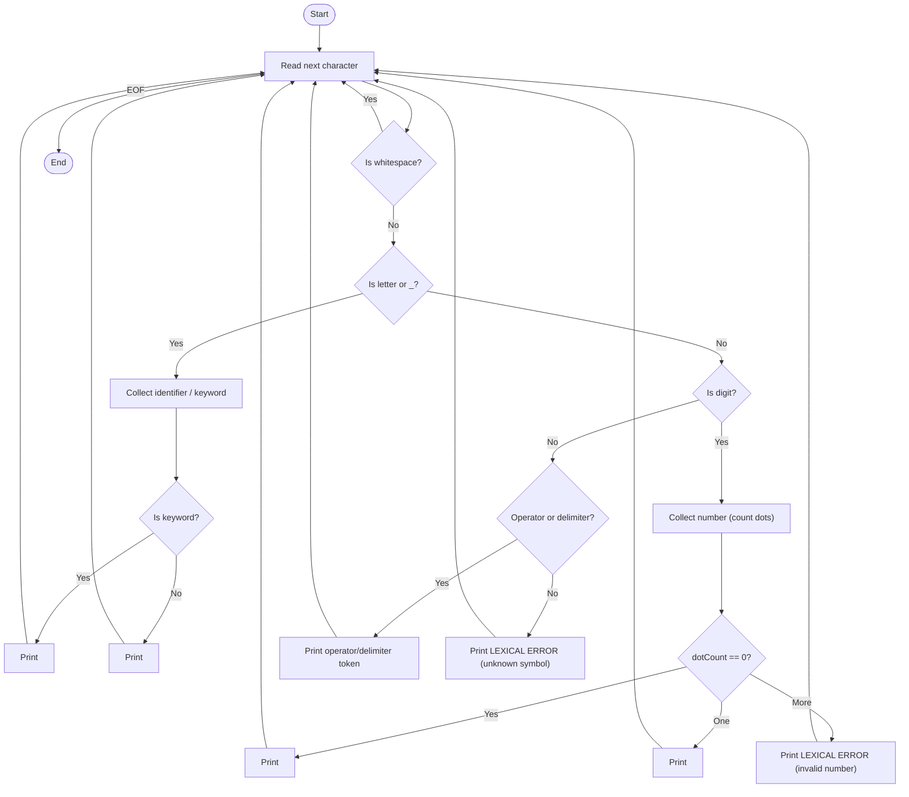

# Lexical Analyzer (`newf.c`) - Code Explanation

This program is a **simple lexical analyzer** written in C.
It reads source-like text from `input.txt`, scans it character by character, and prints tokens such as:
- keywords
- identifiers
- numbers (integer/float)
- operators
- delimiters
- lexical errors

---

## 1) Header Files and Constants

```c
#include <ctype.h>
#include <stdio.h>
#include <string.h>
#define MAX 100
```

- `ctype.h` provides character-checking functions like `isalpha`, `isdigit`, `isalnum`, `isspace`.
- `stdio.h` provides file and input/output functions (`FILE`, `fopen`, `fgetc`, `printf`, etc.).
- `string.h` provides string operations (`strcmp`).
- `MAX` is the maximum size of the token buffer used while building identifiers/numbers.

---

## 2) Global Keyword List

```c
char keywords[][10] = {"int", "float", "if", "else", "while", "print"};
int num_keywords = 6;
```

- `keywords` stores reserved words recognized as `<KEYWORD, ...>`.
- `num_keywords` stores how many keywords are in the list.

---

## 3) Function: `isKeyword`

```c
int isKeyword(char *str)
```

Purpose:
- Checks whether the given token string matches any reserved keyword.

How it works:
1. Loop from `i = 0` to `i < num_keywords`.
2. Compare `str` with `keywords[i]` using `strcmp`.
3. If a match is found, return `1`.
4. If no match is found, return `0`.

---

## 4) Function: `lexicalAnalyzer`

```c
void lexicalAnalyzer(FILE *fp)
```

Purpose:
- Reads characters from the file and classifies them into tokens.

### 4.1 Local setup

```c
int ch, next;
char buffer[MAX];
int i;
```

- `ch` stores the current character read from the file.
- `next` stores a look-ahead character for multi-character operators (`==`, `!=`, `&&`, `||`, etc.).
- `buffer` stores characters of the current token being built.
- `i` is the index into `buffer`.

### 4.2 Main scanning loop

```c
while ((ch = fgetc(fp)) != EOF)
```

- Reads one character at a time until end of file.
- Whitespace is skipped using `isspace(ch)`.

### 4.3 Identifiers and Keywords

Condition:
```c
if (isalpha(ch) || ch == '_')
```

- Starts when token begins with a letter or underscore.
- Continues reading letters, digits, and underscores:
  - `isalnum(...) || ch == '_'`
- Builds token into `buffer`.
- Uses `ungetc(ch, fp)` to put back the first non-token character.
- Calls `isKeyword(buffer)`:
  - if true -> prints `<KEYWORD, token>`
  - otherwise -> prints `<IDENTIFIER, token>`

### 4.4 Numbers (Integer/Float)

Condition:
```c
else if (isdigit(ch))
```

- Starts when first character is a digit.
- Keeps reading digits or dot (`.`) into `buffer`.
- Uses `dotCount` to count decimal points.
- Token classification:
  - `dotCount == 0` -> `<INTEGER, ...>`
  - `dotCount == 1` -> `<FLOAT, ...>`
  - `dotCount > 1` -> lexical error (invalid number)

### 4.5 Operators and Delimiters

Handled in `switch (ch)` block:

- Arithmetic: `+ - * / %` -> `<ARITHMETIC_OP, ...>`
- Relational / assignment / logical-not handling for `< > = !` with optional `=` look-ahead
- Logical AND: `&&`
- Logical OR: `||`
- Delimiters: `( ) { } ; ,`
- Unknown symbols -> lexical error

---

## 5) Function: `main`

```c
int main()
```

Flow:
1. Open file `input.txt` in read mode.
2. If file open fails, print error and return `1`.
3. Call `lexicalAnalyzer(fp)`.
4. Close file with `fclose(fp)`.
5. Return `0` for successful execution.

---

## 6) Variable-by-Variable Explanation

### Global Variables

- `keywords` (`char keywords[][10]`)
  - Stores all recognized reserved words.
  - Each keyword can have up to 9 characters plus null terminator.

- `num_keywords` (`int`)
  - Stores number of entries in `keywords`.
  - Used as loop limit inside `isKeyword`.

### `isKeyword` Variables

- `str` (`char *` parameter)
  - Token string to test against reserved words.

- `i` (`int` local loop variable)
  - Iterates through keyword array indexes.

### `lexicalAnalyzer` Variables

- `fp` (`FILE *` parameter)
  - Input file stream being scanned.

- `ch` (`int` local)
  - Current character read with `fgetc`.
  - Uses `int` (not `char`) so it can safely store `EOF`.

- `next` (`int` local)
  - Next character used for look-ahead in multi-character operators.

- `buffer` (`char[MAX]` local)
  - Temporary token storage while reading identifiers or numbers.

- `i` (`int` local)
  - Current write index in `buffer`.
  - Reset before scanning each new token.

- `dotCount` (`int` local inside number block)
  - Counts number of dots in a numeric token.
  - Used to decide integer/float/invalid number.

### `main` Variables

- `fp` (`FILE *` local)
  - File pointer returned by `fopen` for `input.txt`.

---

## 7) Example Output Format

---

## Flowchart (lexical analyzer)

Below is a Mermaid flowchart that summarizes the main scanning decisions performed by `newf.c`.



---

If your Markdown viewer supports Mermaid, the diagram above will render visually; otherwise it appears as code text. If you'd like, I can also generate a rendered image of the diagram and add it to the repo.

### Rendered PNG (local)

I added `diagram.mmd` (Mermaid source) and `render_diagram.ps1` (PowerShell helper) to render a PNG locally using `@mermaid-js/mermaid-cli`.

To generate the PNG on Windows (requires Node/npm):

```powershell
npx @mermaid-js/mermaid-cli -i diagram.mmd -o diagram.png
# or run the helper script:
.\render_diagram.ps1
```

This will create `diagram.png` in the repo which you can commit and view.

The analyzer prints tokens like:

- `<KEYWORD, int>`
- `<IDENTIFIER, value>`
- `<INTEGER, 42>`
- `<FLOAT, 3.14>`
- `<ARITHMETIC_OP, +>`
- `<DELIMITER, ;>`
- `<LEXICAL ERROR: Unknown symbol @>`

---

## 8) Notes on Safety in This Code

- Buffer writes are guarded with `i < MAX - 1` to avoid overflow.
- Strings are null-terminated with `buffer[i] = '\0'`.
- `ungetc` is used so look-ahead doesn't lose characters.

These help make token extraction safer and more predictable.
